# 📚 GEO 7630 - Laboratoire 1 : Prise en main des outils

## 🎯 Objectif du laboratoire
- Ce premier laboratoire vise à vous familiariser avec les outils essentiels pour le cours **GEO 7630**. 
- Vous apprendrez à créer un environnement de travail collaboratif, accéder à une base de données, manipuler des données géospatiales, et visualiser ces données dans un SIG.

---

## 📝 Tâches à réaliser

### **1. Créer un compte GitHub**
1. Rendez-vous sur [GitHub](https://github.com/) et créez un compte si ce n'est pas déjà fait.
2. Créez un nouveau repository (nommez-le `geo7630h25`).
3. Lancez VSCode sur votre ordinateur.
4. Clonez le dépôt précédemment créé.

   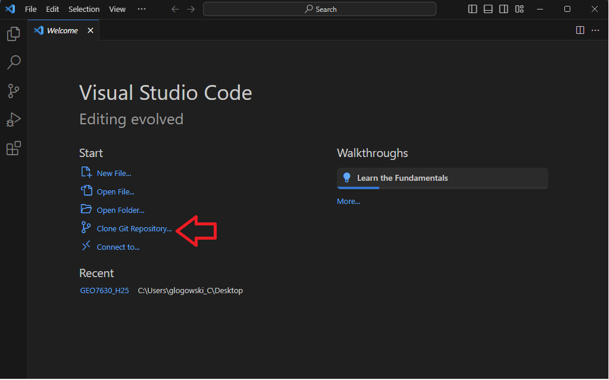

   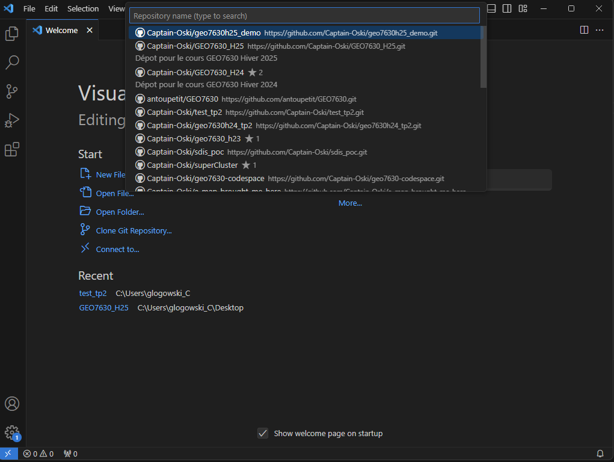

5. Créez un dossier `lab1`.

   

6. Créez un fichier `README.md`.

   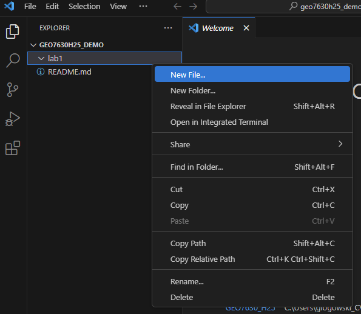

7. Écrivez "Geo7630" dans le fichier `README.md` du nouveau fichier créé.

   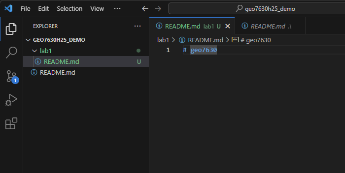

8. Commitez et poussez votre fichier README sur GitHub.

   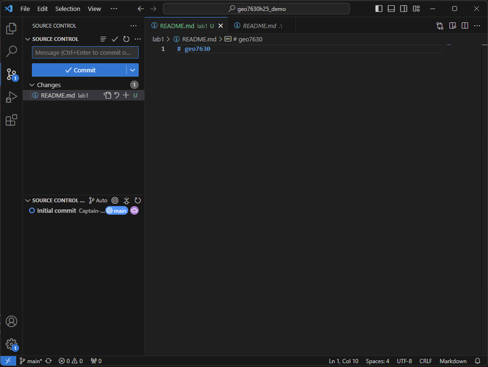

   1. Vous devez maintenant ajouter les changements que vous voulez sauvegarder en appuyant sur le signe +.

   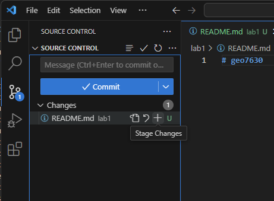

   2. Commitez et poussez votre fichier README.

   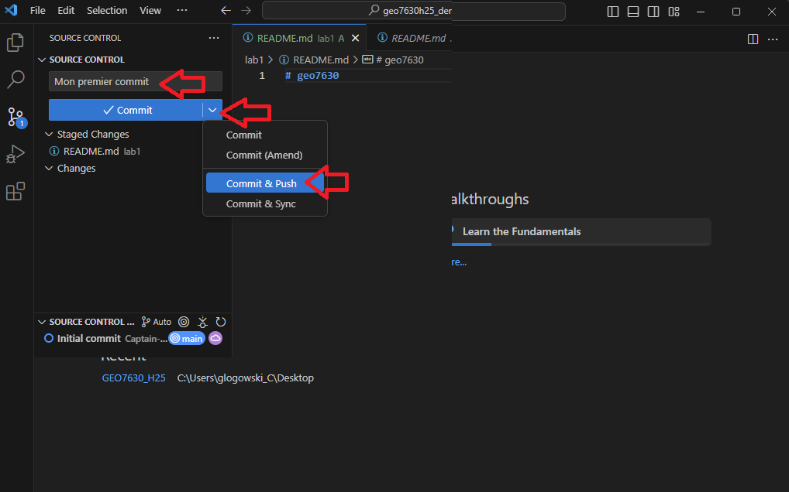

   3. Attention, vous devrez configurer votre VSCode avec votre nom d'utilisateur et votre adresse courriel avant de pouvoir envoyer vos données sur GitHub.
      Appuyez sur `Ctrl + J`.
      Entrez la ligne suivante pour configurer votre nom d'utilisateur :
      ```bash
      git config --global user.name "captain-oski"
      ```
      Entrez la ligne suivante pour configurer votre adresse courriel :
      ```bash
      git config --global user.email "glogowski.clement@uqam.ca"
      ```
      VSCode va vous demander de vous connecter, acceptez et continuez.

---

### **2. Lancer FME Desktop**
- **FME Desktop** est un outil ETL (Extract, Transform, Load) pour le traitement des données géospatiales.
- **Tâche** :
  1. Ouvrez **FME Workbench**.
  2. Créez un nouveau projet.

---

### **3. Lire une adresse depuis un fichier CSV hébergé avec lat/long**
- **Fichier d'entrée** : [Établissements alimentaires Mtl](https://donnees.montreal.ca/dataset/c1d65779-d3cb-44e8-af0a-b9f2c5f7766d/resource/28a4957d-732e-48f9-8adb-0624867d9bb0/download/businesses.csv)
  - **Adresse**
  - **Latitude**
  - **Longitude**

#### **Étapes dans FME** :
1. Utilisez le **Reader** pour importer les données CSV.

   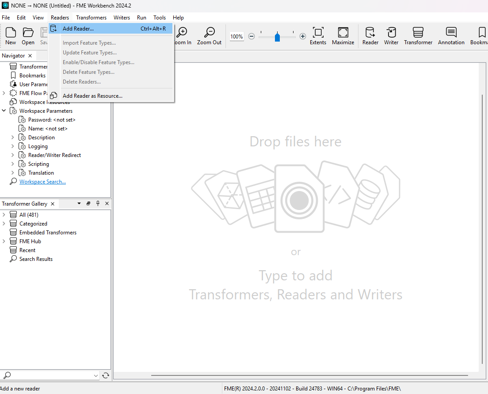

2. Choisissez l'option **web - URL** et copiez-collez l'adresse ci-dessus.

   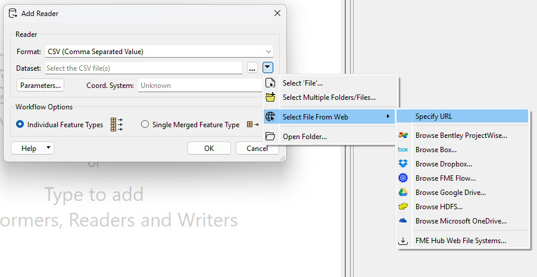

3. Si vous cliquez sur **Paramètre**, vous pourrez pré-inspecter le modèle de données et constater qu'il existe 4 colonnes de coordonnées géographiques.

---

### **4. Injecter la table dans votre schéma PostgreSQL**
- **Processus** :
  1. Configurez un **Writer** dans FME pour PostgreSQL.

  `! Attention il faut que le type de writer soit PostGIS et non PostgreSQL car sinon il ne vous laissera pas créer de colonne géométrie afin d'y stocker correctement les coordonées spatiales.`

  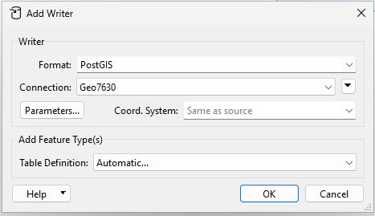

  2. Spécifiez la connexion à votre base de données **Amazon**.
  
   `geo7630h25.cvwywmuc8u6v.us-east-1.rds.amazonaws.com`

   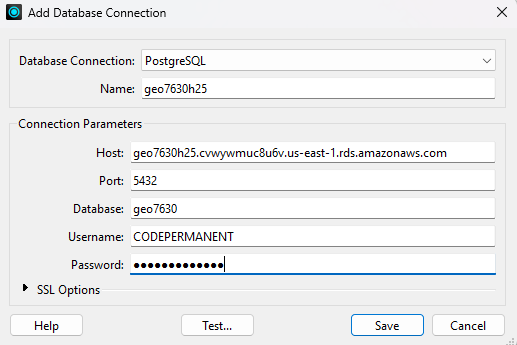


  3. Ajoutez un **TRANSFORMER VertexCreator** pour transformer les colonnes lat/long en géométrie.

   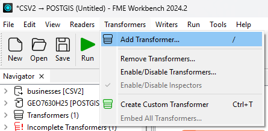

  4. Choisissez les bonnes informations de transformation.

   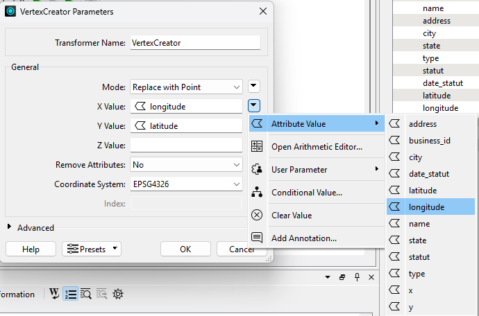

  5. Injectez la table CSV en tant que nouvelle table dans le schéma `public`.

   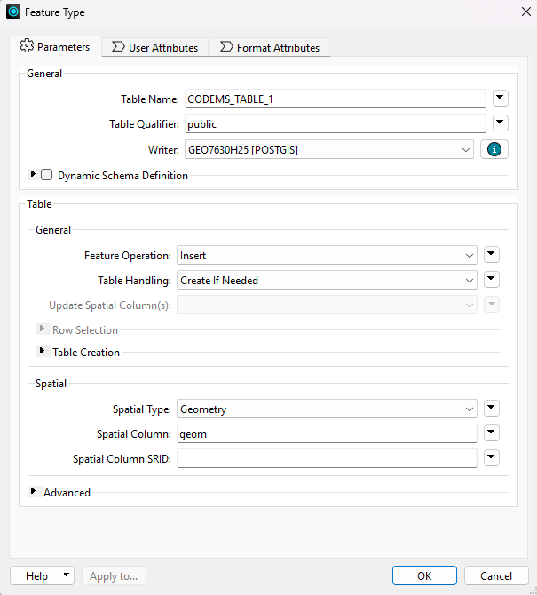

  6. Vérifiez que votre table est bien présente.

   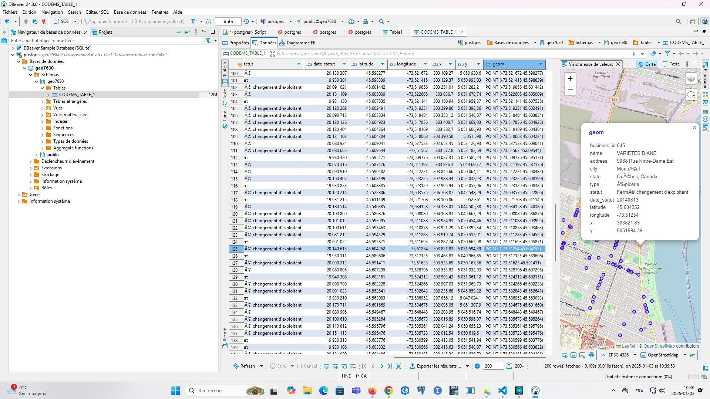

#### **Bonnes pratiques** :
- Utilisez des noms de tables en **minuscules** et avec **underscores** (ex : `lab1_points_adresses`).
- Vérifiez que les géométries sont correctement reconnues.

---

### **5. Visualiser la table dans QGIS**
- **Ouvrez QGIS** et connectez-vous à votre base PostgreSQL :
  1. Ajoutez une nouvelle connexion à la base de données.

   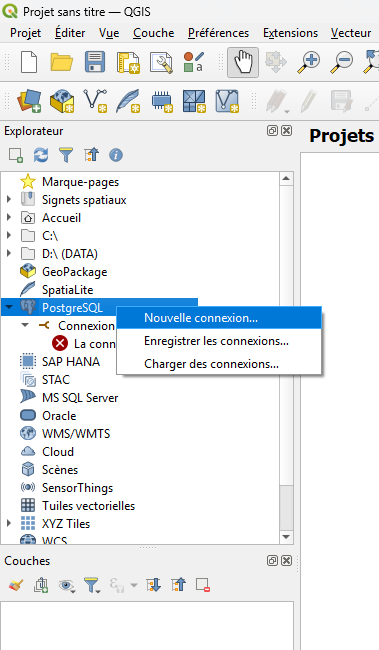

   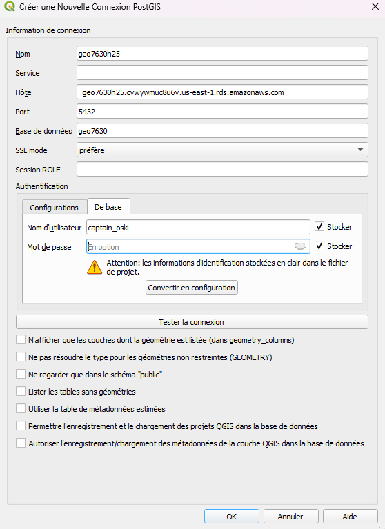

  2. Visualisez la table importée.

   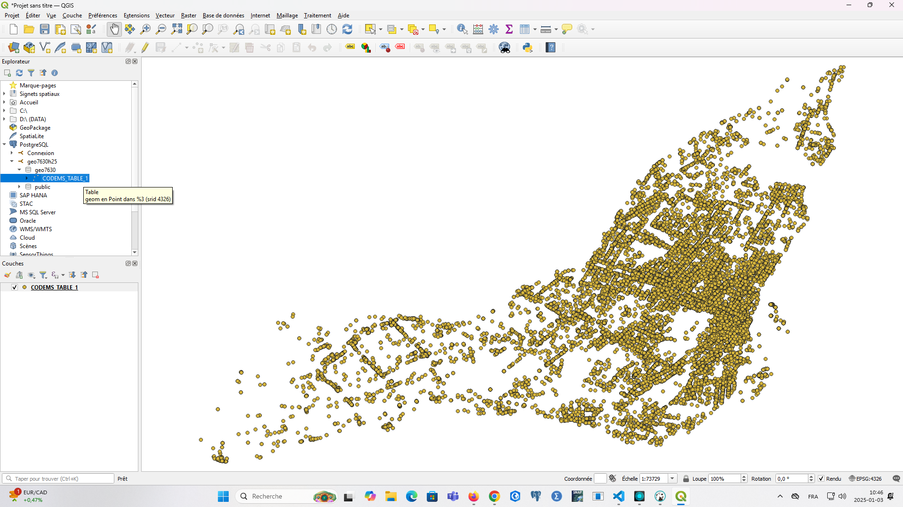

  3. Donnez un style à votre couche de points.

   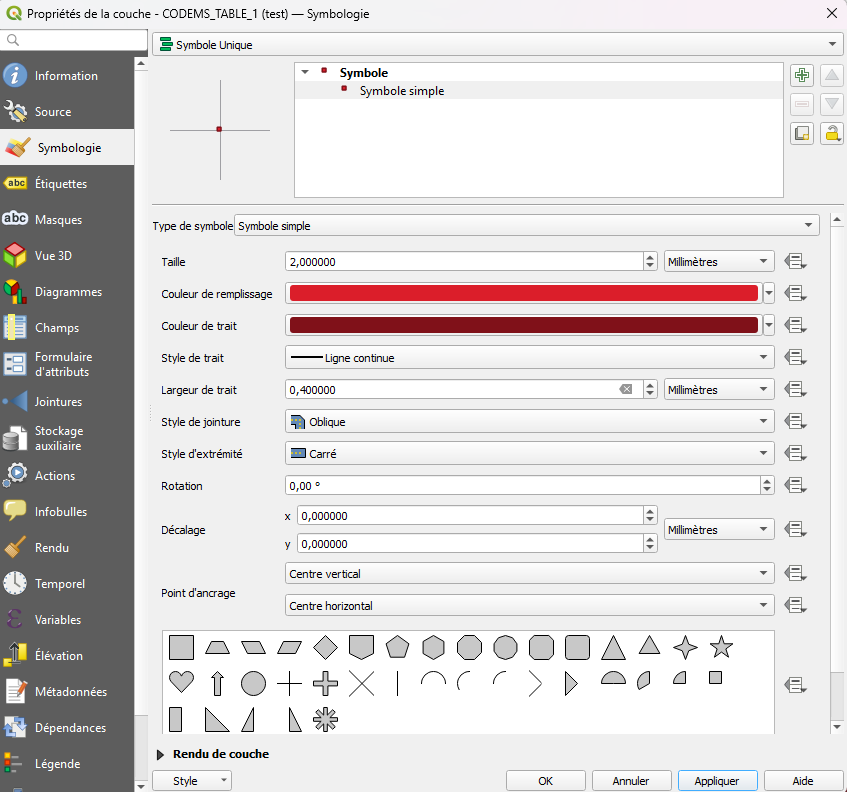

  4. Sauvegardez votre style dans la base de données.

   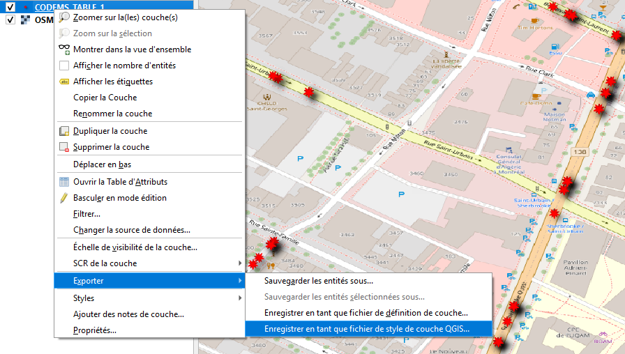

   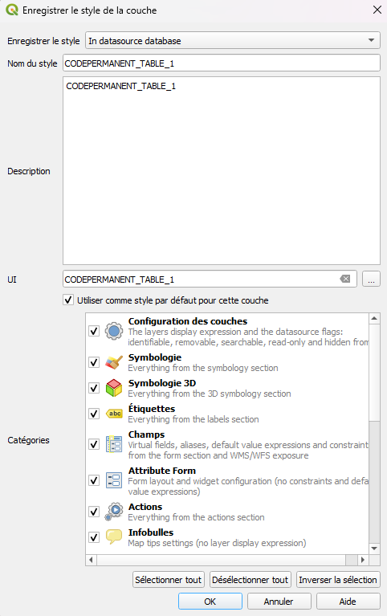

#### **Validation** :
- Assurez-vous que les points sont correctement positionnés selon les coordonnées **lat/long**.
- Prenez une capture d’écran de la carte avec la couche affichée.

---

## 📝 Matériel à remettre
1. **Dépôt GitHub** :
   - Incluez un **README.md** documentant les étapes effectuées.
2. **Capture d’écran QGIS** montrant la table importée et visualisée sur la carte, à copier et coller dans le README comme vu au lab.

---

## 🧾 Grille d'évaluation

| Critère                                      | Pondération   |
|--------------------------------------------|--------------:|
| **Ajout d'une capture d'écran de votre carte QGIS dans le README.md du dossier lab1**          | 100%          |

---

## 🚀 Conseils pour réussir
1. **Suivez chaque étape** avec attention pour éviter les erreurs de connexion ou de format de données.
2. **Nommez correctement vos fichiers et tables** selon les conventions.
3. **Testez la connexion** entre les outils pour valider votre processus.
4. Documentez bien les étapes dans votre **README.md**.

---

## 📂 Ressources utiles
- **FME Documentation** : [FME Docs](https://docs.safe.com/)
- **QGIS Documentation** : [QGIS Docs](https://qgis.org/en/docs/)
- **DBeaver Community** : [DBeaver](https://dbeaver.io/)
- **GitHub** : [Créer un compte GitHub](https://github.com/)
- **Markdown Guide** : [Guide Markdown](https://www.markdownguide.org/)

---

**Bon début de session et bon laboratoire !** 🚀
