# Laboratoire 10 - GEO7630H24  
## Configuration Geoserver et mise en place de services WMS, WFS

### **Étape 1 : Configuration et lancement d’une instance de Geoserver**

1. Ouvrez GitHub et assurez-vous d’être connecté : [GitHub GEO7630_H24](https://github.com/Captain-Oski/GEO7630_H24).
2. Lancez un Codespace à partir de la branche **Main**.
3. Cela démarre un environnement virtuel où vous pourrez modifier et tester du code, ainsi que démarrer des services cartographiques.

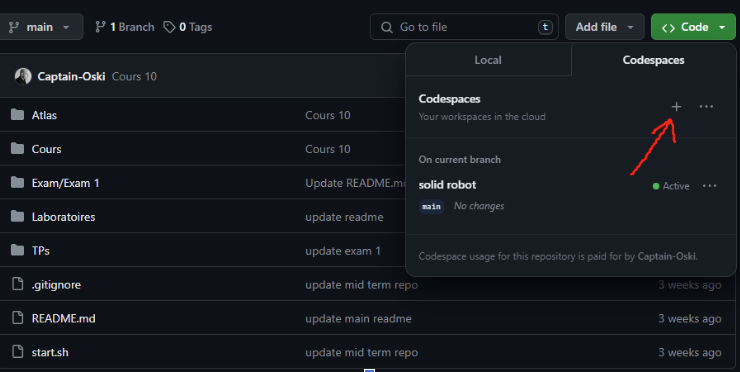

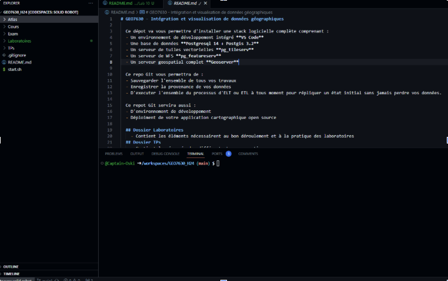
---

### **Étape 2 : Configuration de l’environnement**

1. Copiez-collez le fichier **.env.example** situé dans le dossier **Atlas**.
2. Renommez le fichier en **.env** (supprimez le **.example**).
3. Modifiez les variables d’environnement avec vos informations personnelles :

   ```plaintext
   DB_USER=CODEPERMANENT
   DB_PASSWORD=VOTREMOTDEPASSE
   DB_HOST=geo7630h25.cvwywmuc8u6v.us-east-1.rds.amazonaws.com
   DB_NAME=geo7630
   ```

4. Dans le dossier **Atlas**, faites un clic droit sur le fichier **docker-compose.yml** et sélectionnez **Compose Up**.

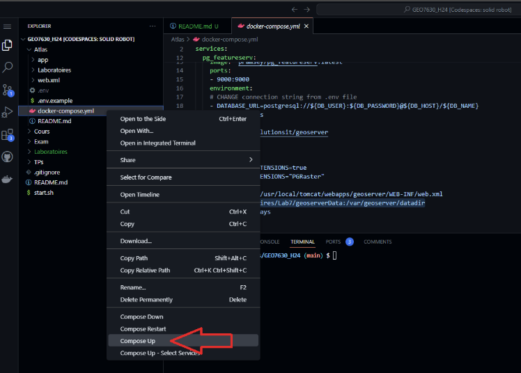

5. Si l’option **Compose Up** n’apparaît pas, installez l’extension **Docker**. (Ctrl+shift+x cherchez Docker)

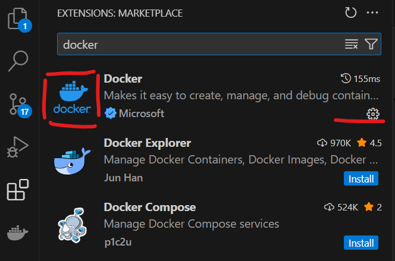

6. Vérifiez que les conteneurs s’exécutent correctement en consultant l’icône de la baleine Docker.


7. Ouvrez un terminal (**CTRL+J**) et testez l’application en accédant à son interface web.

---

### **Étape 3 : Ajout de contrôles de carte**

Dans le fichier **/Atlas/app/app.js**, ajoutez les contrôles suivants :

- **Contrôle de navigation** :
  ```javascript
  var nav = new maplibregl.NavigationControl({
      showCompass: true,
      showZoom: true,
      visualizePitch: true
  });
  map.addControl(nav, 'top-right');
  ```
- **Contrôle de géolocalisation** :
  ```javascript
  var geolocateControl = new maplibregl.GeolocateControl({
      positionOptions: { enableHighAccuracy: true },
      trackUserLocation: true
  });
  map.addControl(geolocateControl, 'bottom-right');
  ```
- **Contrôle d’échelle** :
  ```javascript
  var scale = new maplibregl.ScaleControl({ unit: 'metric' });
  map.addControl(scale);
  ```
Rechargez la page pour voir les contrôleurs s’afficher.


Voici tous les différents Markers and Controls pour votre carte 

https://maplibre.org/maplibre-gl-js/docs/API/#markers-and-controls


---

### **Étape 4 : Chargement de données depuis un serveur de tuiles vectorielles**

#### 1. 


Une source de tuiles vectorielles est définie par une URL qui suit le schéma {z}/{x}/{y}.pbf, où :
- z représente le niveau de zoom
- x et y représentent les coordonnées de la tuile
- ! La source doit être déclarée avant d’ajouter une couche qui l’utilise.

#### 1. Accédez à l’interface d’administration du serveur de tuiles (par exemple pg_tileserv).
#### 2. Recherchez le service de tuiles vectorielles correspondant à votre couche.

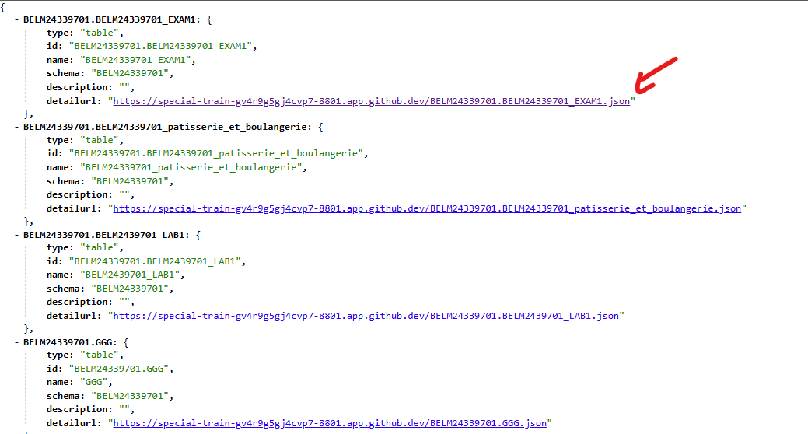

#### 3. Copiez l’URL du service et remplacez-la dans le script.

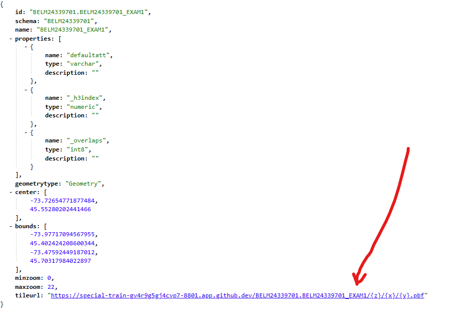

#### 4. Utilisation du source-layer

Le source-layer correspond au nom de la couche à afficher à partir du service de tuiles.
Il est essentiel d’utiliser le bon nom, qui est défini dans la configuration du serveur de tuiles.
- Voir la propriété name du .json du service

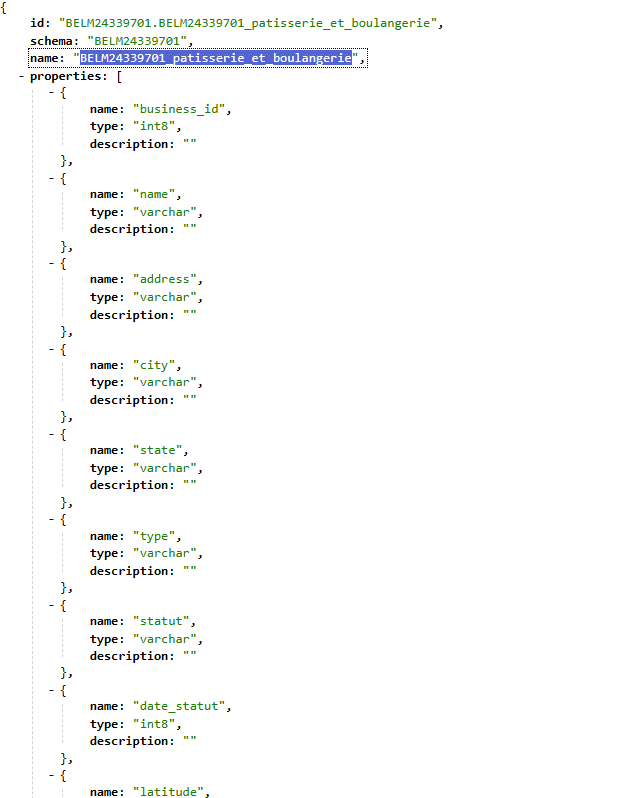

Vous pouvez maintenant : 
#### 5. Ajoutez la méthode **map.onLoad()** dans **app.js** :
- Pour plus d'information assurez-vous de voir la documentation du code dans app.js

```javascript
map.on('load', function () {
    map.addSource('NOM QUE VOUS SOUHAITEZ DONNER À VOTRE SOURCE', {
        type: 'vector',
        tiles: ['https://your-server-url/PROPRIÉTÉ IS DE LA SOURCE.JSON/{z}/{x}/{y}.pbf']
    });
    map.addLayer({
        'id': 'IDENTIFIANT UNIQUE DU LAYER QUE VOUS SOUHAITEZ DONNER ',
        'type': 'fill',
        'source': 'NOM QUE VOUS AVEZ DONNÉ À VOTRE SOURCE',
        'source-layer': 'PROPRIÉTÉ IS DE LA SOURCE.JSON'
    });
});
```

#### 6. Rechargez la carte pour voir les données s'afficher.

Vérification et dépannage

Si les tuiles ne s’affichent pas :
- Vérifiez que le service de tuiles est bien public et accessible.


- Assurez-vous que l’URL utilisée est correcte.
- Ouvrez la console du navigateur (F12 > Console) pour vérifier s’il y a des erreurs.
- Testez l’URL dans un navigateur pour voir si les tuiles sont bien générées.

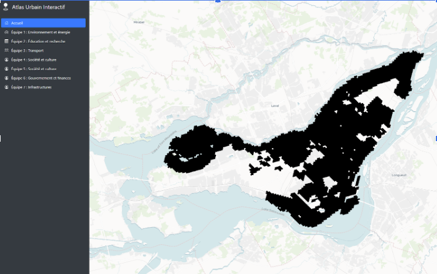
---

### **Étape 5 : Stylisation**

Ajoutez une propriété **paint** pour modifier le rendu :

```javascript
'paint': {
    'fill-color': '#FF0000',
    'fill-opacity': 0.5
}
```
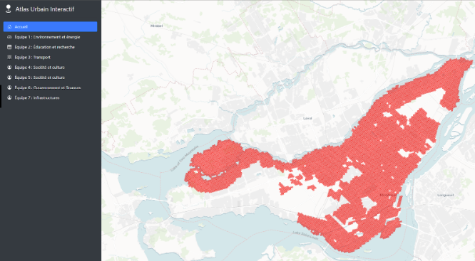
---

### **Étape 6 : Style avancé**

Appliquez un style basé sur une interpolation linéaire :

```javascript
'paint': {
    'fill-color': [
        'interpolate',
        ['linear'],
        ['get', 'acp_sociale'],
        0, 'rgb(255, 255, 255)',
        1, 'rgb(0, 0, 255)'
    ],
    'fill-opacity': 0.7
}
```

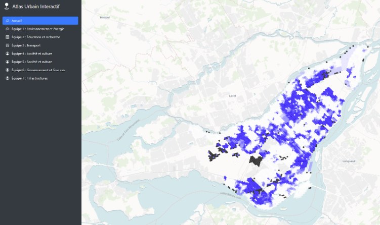

---

### **Étape 7 : Ajout d’une couche WFS**

0. Utilisez FME pour charger les limites d'arrondissements dans votre schéma de bases de données (nommer la table aussi simplement que `arrondissements`)

Ensuite

1. **Rendez le port 9000 (pg_featureserv) public**.
2. Ajoutez une fonction **loadWFS()** dans **app.js** :

```javascript
function getRandomColor() {
    var letters = '0123456789ABCDEF';
    var color = '#';
    for (var i = 0; i < 6; i++) {
        color += letters[Math.floor(Math.random() * 16)];
    }
    return color;
}

function loadWFS() {
    map.addSource('arrondissements-source', {
        type: 'geojson',
        data: 'https://URL WEB DE VOTRE CODESPACE/collections/CODEPERMANENTS.arrondissements/items.json?limit=10000'
    });
    map.addLayer({
        'id': 'arrondissements',
        'type': 'fill',
        'source': 'arrondissements-source',
        'paint': {
            'fill-outline-color': 'black',
            'fill-color': getRandomColor(),
            'fill-opacity': 0.3
        }
    });
}
```

3. **Ajoutez un bouton HTML** pour déclencher la fonction :

```html
<button type="button" class="btn btn-primary" onclick="loadWFS()">Load WFS Data</button>
```

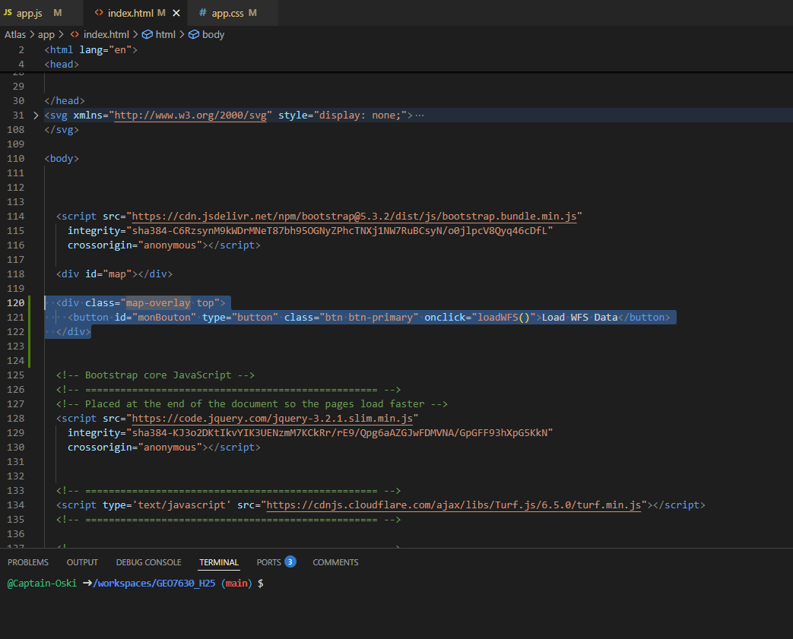

Rechargez la page et cliquez sur le bouton pour afficher la couche WFS.

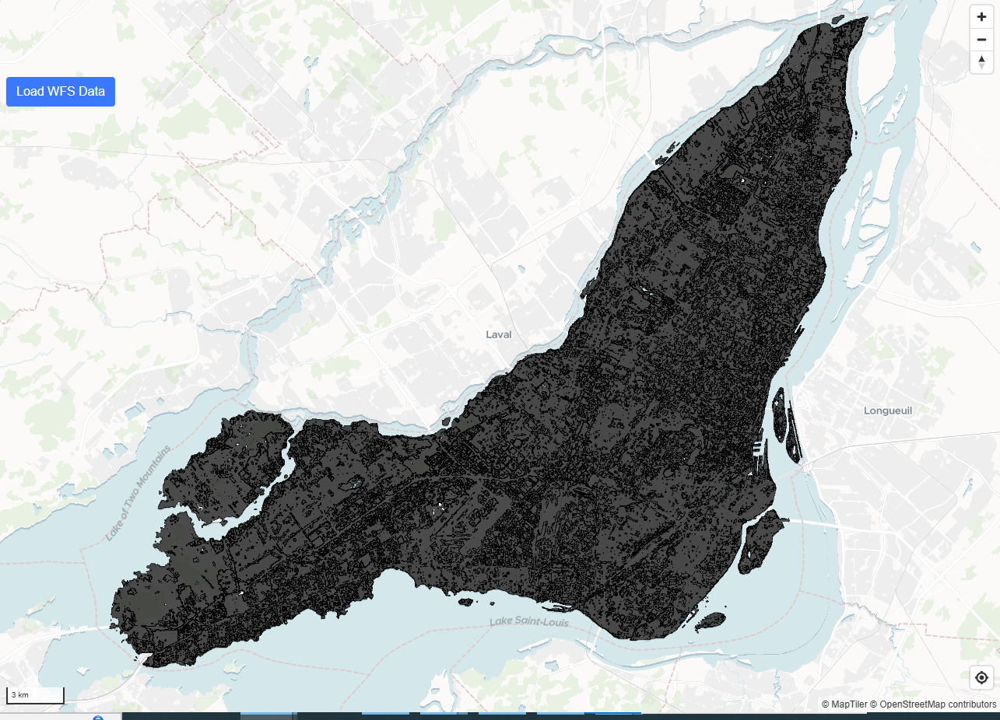

---

### **Conclusion**

Vous avez maintenant une configuration fonctionnelle de Geoserver avec des services WMS et WFS intégrés à une application MapLibreGL. La semaine prochaine, nous aborderons :

- Les filtres dynamiques
- Le déplacement automatisé
- Les événements de souris (popup et interactions avancées)
- La visualisation avancée

