Intégration matricielle FME + QGIS

Laboratoire #2 

# Objectifs

- Est de lire 1 ou plusieurs types de raster, TIF, Geotiff PNG

- Est de travailler le raster pour extraire les valeurs et les transformer en vecteur

- De stocker nos rasters purement non tuilés dans Postgresql

- De tuiler nos raster en plusieurs petites images

- De tuiler et pyramider nos raster en pour la diffusion web

- Extraire les valeurs de Z pour les donner au vecteur

# Données 

# [Données lab 2](https://drive.google.com/drive/folders/1iRcyRWS_JiTciNdonm8leC7Nq03hRY5_?usp=sharing)

Dézippez les données sur votre ordinateur

# Démarrage du laboratoire #2

Drag and drop chacun des 3 fichiers suivant pour ajouter un **_READER_**

PNG Reader pour l'image aérienne (donc le fichier .png)

COG ou TIF Reader les ilôts de chaleur (donc le fichier .tif)

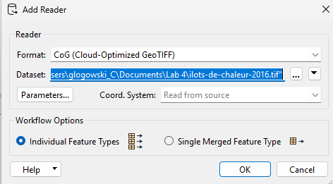

COG ou TIF Reader le modèle numérique de surface (MNS) (donc le 2eme fichier .tif)

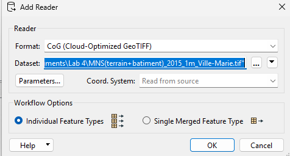

Créez 1 bookmark pour chacun des READERs (ctrl+b)

- Raster analytique - Îlots de chaleurs

- Image aérienne - Ville Marie

- MNS - Ville Marie - 1m res

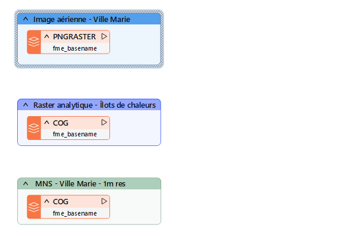

# 1ère partie - Intégration d’image aérienne standard

## Étape 1 

- Reprojetez le raster en EPSG:32188

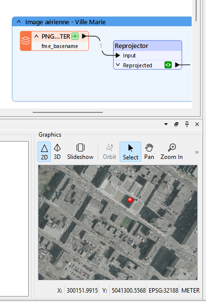

## Étape 2

- Extraction des métadonnées du raster avec le **_RasterPropertyExtractor_**

**_Le transformateur "RasterPropertyExtractor" dans FME est utilisé pour extraire des propriétés et des métadonnées d'un raster, telles que la dimension, le type de données, le nombre de bandes, et d'autres informations essentielles à son analyse et traitement._**

On voit ici le nombre de bandes (4), de rangées(17127) et de colonnes de pixels (16732).

On y voit aussi les coordonnées minimales et maximales dans les 2 axes et beaucoup d'autres métadonnées intéressantes qui pourront nous servir un jour.

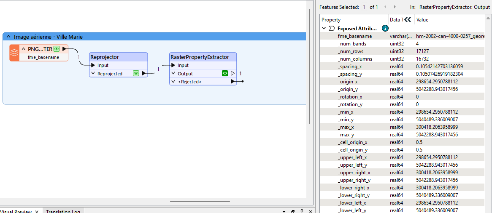

## Étape 3

- Ajoutez un **_RasterResampler_**  et "resampler" les rows / columns par 10

**_Le transformateur "RasterResampler" dans FME est utilisé pour redimensionner ou rééchantillonner une image raster, ajustant ainsi sa résolution, sa taille ou sa géométrie pour répondre à des exigences spécifiques ou pour l'aligner avec d'autres données spatiales._**

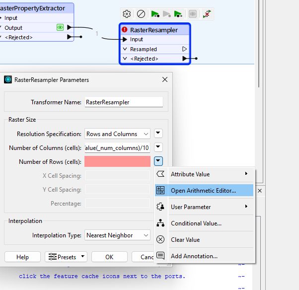

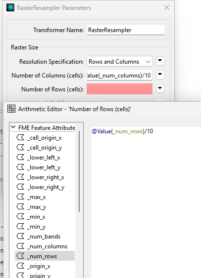

##

## Étape 5

- Ajoutez un **_rasterPyramider_** 

  - Changez l’option pour Number of levels et choisissez 10

**_Le transformateur "RasterPyramider" dans FME est utilisé pour créer une série de pyramides raster, c'est-à-dire des versions de résolution inférieure d'une image raster originale, ce qui optimise l'affichage et l'analyse de grandes images sur différents niveaux de zoom._**

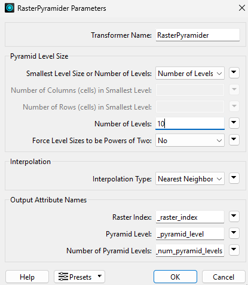

## Étape 6

- AJOUTEZ un **_FeatureWriter_**

* Il permet de chaîner les actions à la suite de l’écriture, contrairement au **_Writer_** de base

Nom de la table : `hm-2002-can-4000-0257`

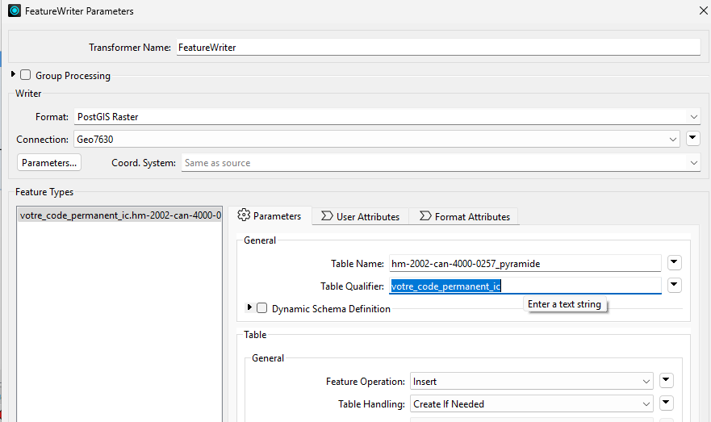

## Étape 7 

- Ajouter un **_SQLExecuter_** à la suite du **_FeatureWritter_** Summary

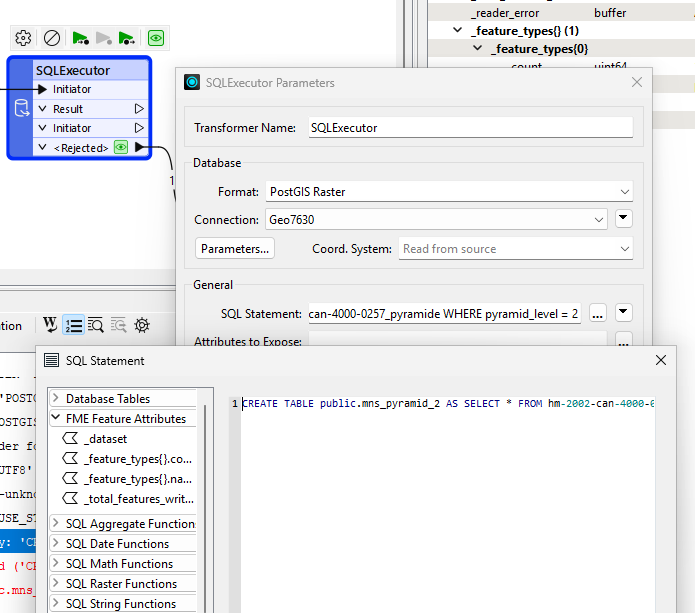

- Voici la **_requête_** à exécuter : 

* **_CREATE TABLE VOTRECODEMS.mns\_pyramid\_lvl_2 AS SELECT \* FROM "hm-2002-can-4000-0257\_pyramide" WHERE "\_pyramid\_level" = 2_**

- Ouvrez QGIS et chargez la table dans la BD pour voir l’image satellite avec un niveau de pyramidage de 2

# 2eme partie - Intégration de raster analytique - Ilôts de chaleur

## Étape 1

- Reprojetez les îlots de chaleur en 32188

## Étape 2

- Ajoutez un **_RasterToPolygonCoercer_** et connectez-la avec la couche re-projetée 

  - Changez le Label Attribute pour **_classification_**

**_Le transformateur "RasterToPolygonCoercer" dans FME convertit des images raster en entités vectorielles polygonales, permettant l'analyse et la manipulation de données raster comme des entités vectorielles dans des applications GIS et de cartographie._**

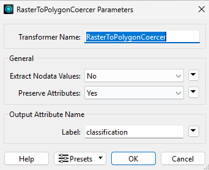

##

## Étape 3

- Écrivez le résultat du **_RasterToPolygonCoercer_** dans la BD (Postgis)

  - Attention le Writer doit être un **Postgis** tout court et non **_Postgis Raster_** car on écrit du vecteur

* Nom de la table : **_ilots\_chaleur\_polygones_**

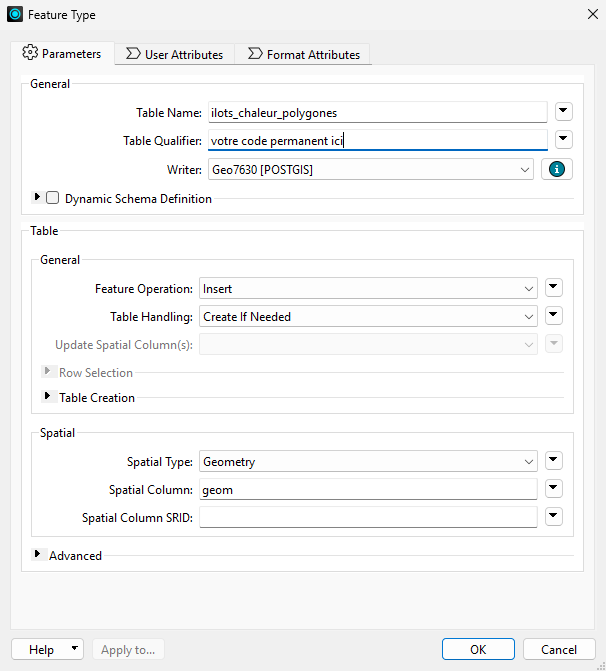

## Visualisation QGIS

Clasification 

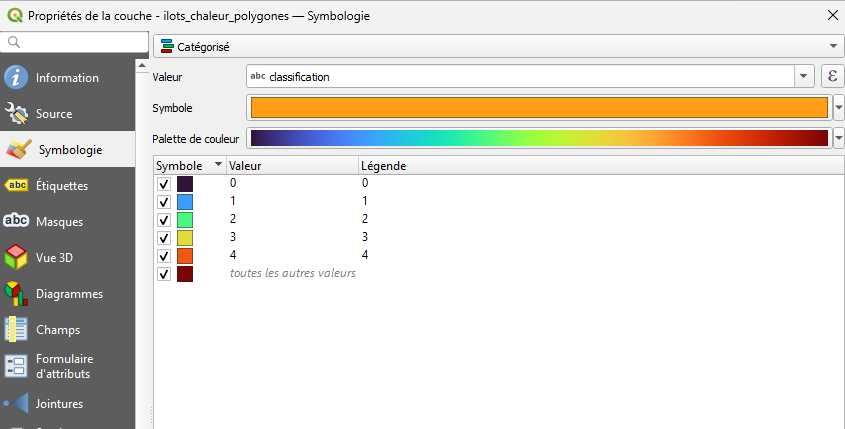

Résultats

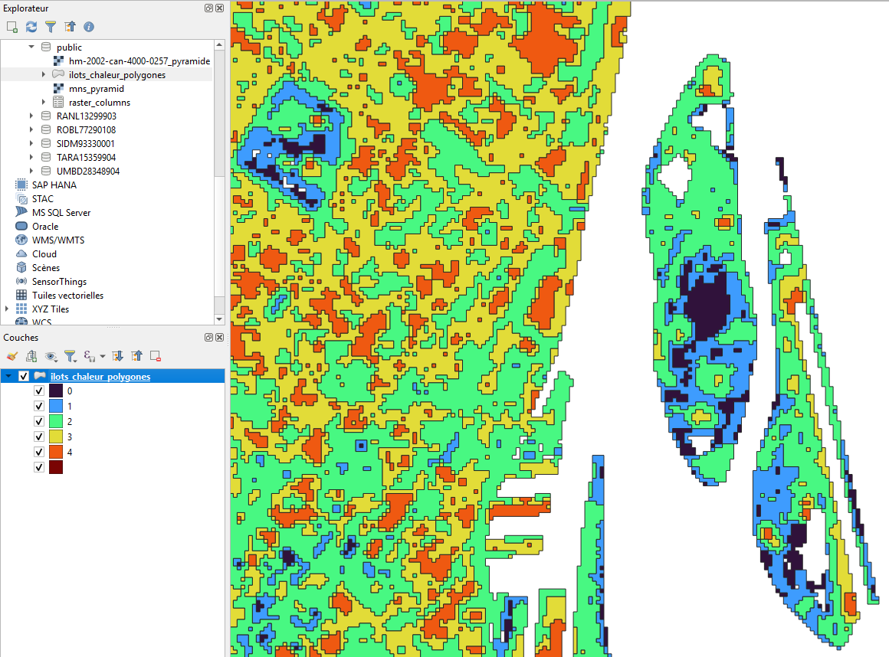

Étape 4

- Ajoutez un **_RasterDiffuser_** et connectez-la avec la couche re-projetée 

  - Options par Défaut

**_Le transformateur "_RasterDiffuser_" dans FME est utilisé pour améliorer la netteté d'une image raster, en accentuant les bords et les détails pour rendre l'image plus claire et plus définie._**

  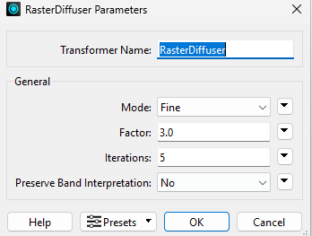

## Étape 5

- Ajoutez un **_RasterCellValueRounder_******&#x20;

  - Decimal places = 1 

Étape 6

- Ajoutez un **_RasterToPolygonCoercer_** 

  - (\_label = classification)

## Étape 7

- Écrivez le résultat du **_RasterToPolygonCoercer_** dans la BD (Postgis)

- Nom de la table : **_ilots\_chaleur\_polygones\_sharp**

## Visualisation QGIS!

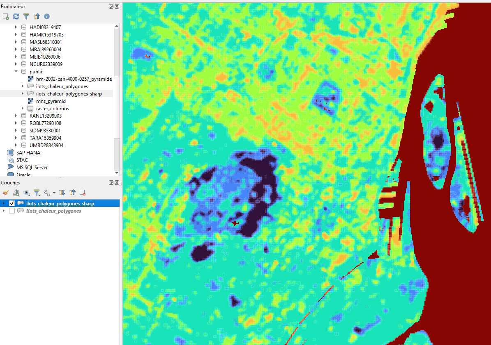

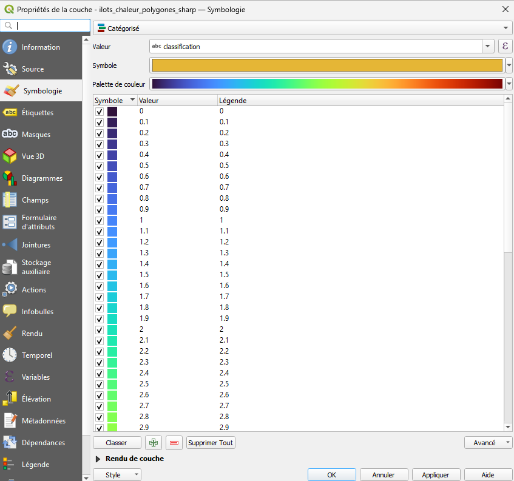

##

## Étape 8

- Ajoutez un **_RasterCellCoercer_** et connectez-la avec la couche re-projetée 

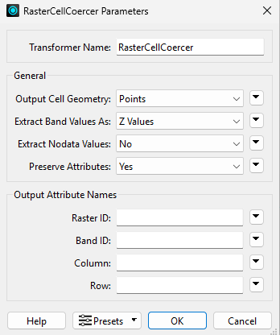

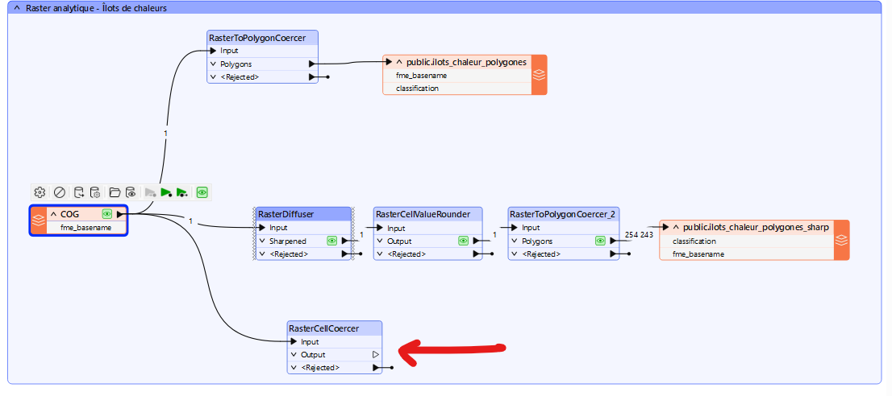

## Étape 9

- Écrivez le résultat du **_RasterCellCoercer_** dans la BD (Postgis)

- Nom de la table : **_ilots\_chaleur\_points_**

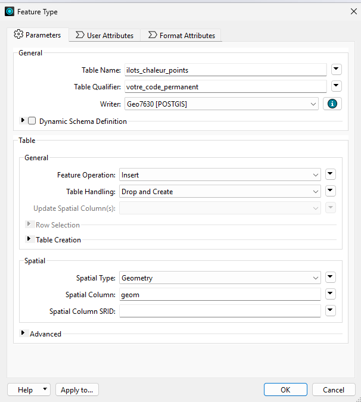

# Visualisation QGIS

(pour extraire la valeur Z dans les props : $z )

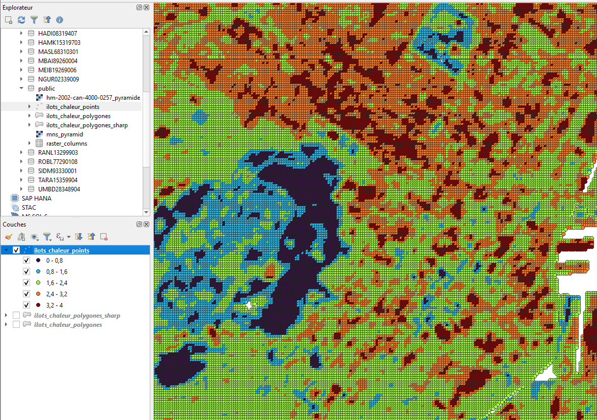

# 3eme partie Intégration de raster (MNS)

## Étape 2

1. Ajoutez un **_ContourGenerator_** 

**_Le transformateur "ContourGenerator" dans FME est utilisé pour créer des lignes de contour à partir d'une surface raster, représentant des niveaux d'altitude à intervalles réguliers_**

1. Cette étape est coûteuse, si on change à la baisse les options d’interval entre contour, pour ce MNS là une option d’interval à 10m prend environ 5 minutes à rouler

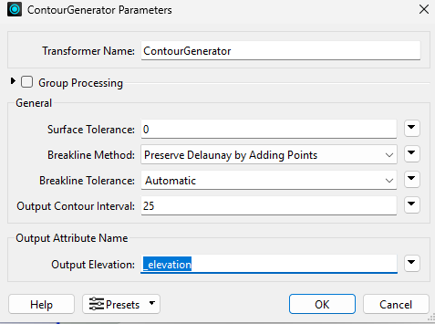

## Étape 3

- Ajoutez un **_Generalizer_**

**_Le transformateur "Generalizer" dans FME est utilisé pour simplifier ou lisser la géométrie des entités en réduisant le nombre de sommets, tout en conservant la forme générale._**

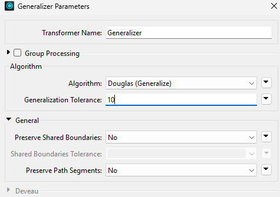

##

## Étape 4

- Ajoutez un **_AreaBuilder_**

Laissez les options par défaut

**_Le transformateur "AreaBuilder" dans FME sert à créer des polygones (zones) à partir de lignes ou de points en fermant les contours ouverts et en définissant des limites spatiales._**

## Étape 5

- Écrivez le résultat du champ **_Area_** du Transformer **_AreaBuilder_** dans la BD (Postgis)

- Nom de la table : **_mns\_contour\_polygones_**

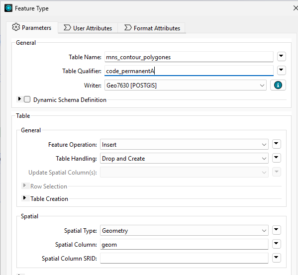

## Visualisation QGIS

Nous sommes maintenant capables d'avoir des polygones vectoriels qui possèdent une propriété d'élévation, ce qui va nous permettre plus tard de faire une jointure spatiale entre ces points ou ces polygones et les bâtiments pour faire de l'extrapolation 2.5D.

(L'image ici est plus précise que celle que vous avez car j'ai fait roulé avec une meilleure résolution)

\
